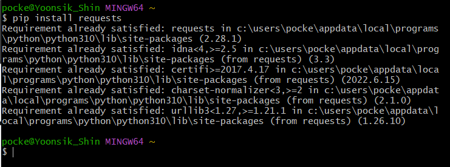
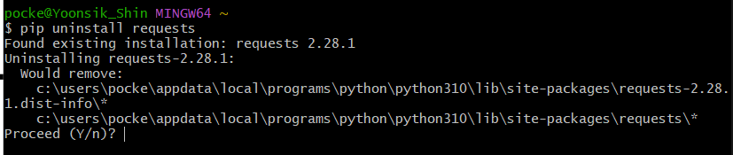
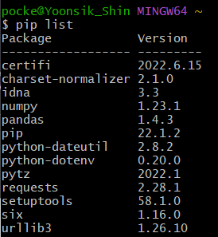
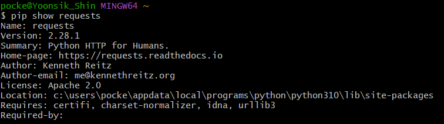
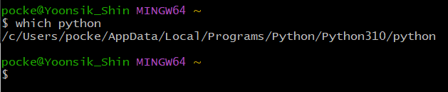

# ❓파이썬 응용/심화

​    

## 1️⃣ 파이썬 응용/ 심화

### 1. 리스트 표현식 (List Comprehension)

- 표현식과 제어문을 통해 특정한 값을 가진 리스트를 간결하게 생성하는 방법

```python
[<표현식> for <변수> in <반복가능한객체>]
[<표현식> for <변수> in <반복가능한객체> if <조건식>]
```

```python
# 예시 : 1 ~ 3의 세제곱의 결과가 담긴 리스트 만들기
# 일반식
cubic_list = []
for number in range(1, 4):
    cubic_list.append(number**3)
print(cubic_list)

# 표현식
[number**3 for number in range(1, 4)]
```

​    

### 2. 딕셔너리 표현식 (Dictionary Comprehension)

- 표현식과 제어문을 통해 특정한 값을 가진 리스트를 간결하게 생성하는 방법

```python
{key:value for <변수> in <반복가능한객체>}
{key:value for <변수> in <반복가능한객체> if <조건식>}
```

```python
# 예시 : 1 ~ 3의 세제곱의 결과가 담긴 딕셔너리 만들기
# 일반식
cubic_dict = {}
for number in range(1, 4):
    cubic_list[number] = number ** 3
print(cubic_list)

# 표현식
{number: number**3 for number in range(1, 4)}
```

​    

### 3. 람다함수 (Lambda Function)

```python
# 일반함수식
def function(1️⃣x):
    return 2️⃣x*2  

# 람다함수식
lambda x1️⃣: 2️⃣x*2 
```

- 표현식을 계산한 결과값을 반환하는 함수
- 이름 없는 함수라는 의미로 `익명함수`라고도 불림
- 특징
  - return문을 가질 수 없음
  - 간편한 조건문만 사용 가능 (복잡한 조건문, 반복문은 사용 불가)
- 장점
  - 함수를 정의하여 사용하는 것보다 간결하게 사용가능 (함수명 생각할 필요x)
  - def를 사용할 수 없는 곳에서도 사용가능

​    

### 4. 필터함수 (Filter Function)

```python
def 1️⃣odd(n):
    return n % 2
2️⃣numbers = [1, 2, 3]
result = filter(1️⃣odd, 2️⃣numbers)
print(result, type(result))
>> <filter object at 0x453ed453cfd> <class 'filter'>
```

- 순회 가능한 객체의 모든 요소에 함수를 적용하고 그 결과가 True인 것들을 filter 객체로 반환함

- ✔️ map함수와 유사

​    

### 5. 랜덤 모듈

```py
import random

random.random()                  # 0이상 1미만의 모든 수 뽑기
random.uniform(1, 7)             # 두 수 사이의 랜덤 실수 뽑기
random.randint(1, 7)             # 두 수 사이의 랜덤 정수 뽑기
random.randrange(1, 7[, step])   # 1이상 7미만의 정수 뽑기
random.shuffle()                 # 무작위로 섞기
random.choice()                  # 리스트안에서 무작위로 하나 뽑기
random.sample(lst, 3)            # 리스트안에서 무작위로 3개 뽑기
```

​    

---

## 2️⃣ 모듈

### 파이썬 표준 라이브러리 (Python Standard Library, PSL)

- 파이썬 기본 설치 모듈, 내장함수

>  [파이썬 표준 라이브러리 문서](https://docs.python.org/ko/3/library/index.html)

​    

### 파이썬 패키지 관리자 (PIP)

- PyPI (Python Package Index)에 저장된 외부 패키지들을 설치하도록 도와주는 패키지 관리 시스템

​    

> 패키지 설치

- 최신 버전 / 특정 버전 / 최소 버전을 명시하여 설치할 수 있음

```bash
$ pip install SomePackage
$ pip install SomePackage==1.0.5
$ pip install 'SomePackage>=1.0.4'
```

- 이미 설치되어 있는 경우 이미 설치되어 있음을 알리고 아무것도 하지 않음



​    

> 패키지 삭제

- 패키지를 업그레이드하는 경우 과거버전을 자동으로 지워줌

```bash
$ pip uninstall SomePackage
```



​    

> 패키지 목록 및 특정 패키지 정보

```bash
$ pip list
```



```bash
$ pip show SomePackage
```



​    

>패키지 freeze

- 설치된 패키지의 비슷한 목록을 만들지만, pip install에서 활용되는 형식으로 출력
- 해당하는 목록을 requirements.txt (관습)으로 만들어 관리함

```bash
$ pip freeze
```

​    

> 패키지 관리하기

- 일반적으로 패키지를 기록하는 파일의 이름은 requirements.txt로 정의

```bash
$ pip freeze > requirements.txt     # 패키지 목록 관리
$ pip install -r requirements.txt   # 패키지 목록 설치
```

​    

---

## 3️⃣ 가상환경

> 가상환경 사용이유

- 복수의 프로젝트를 하는 경우 패키지와 모듈의 버전이 상이할 수 있음

  ```bash
  과거 외주 프로젝트 - django버전 2.0001
  신규 회사 프로젝트 - django버전 3.0022
  ```

- 이러한 경우 가상환경을 만들어 프로젝트별로 독립적인 패키지를 관리할 수 있음

​    

> 파이썬 실행은 특정 경로에 있는 프로그램을 실행시키는 것



​    

> venv

- 가상환경을 만들고 관리하는데 사용되는 모듈 (Python 3.5 이후)
- 특정 디렉토리에 가상환경을 만들고, 고유한 파이썬 패키지 집합을 가질 수 있음

​    

> 가상환경 생성

```bash
$ python -m venv <폴더명>
```

- 가상환경을 생성하면, 해당 디렉토리에 별도 파이썬 패키지가 설치됨

​    

> 가상환경 활성화 / 비활성화

```bash
# 활성화
$ source <폴더명>/Scripts/activate

# 비활성화
$ deactivate
```