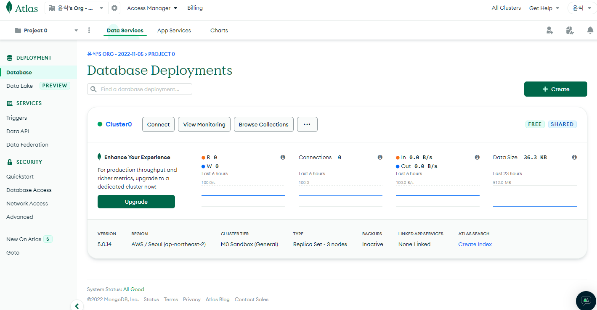
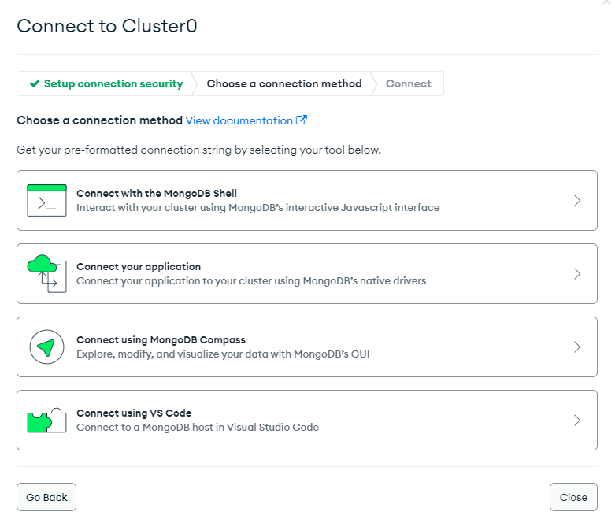
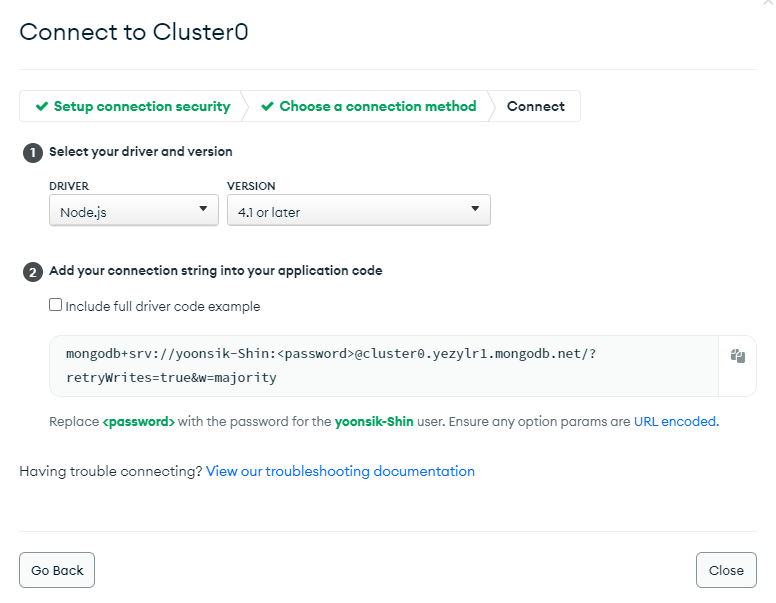
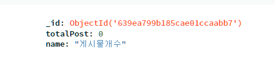

node.js 

node_modules : 라이브러리에 필요한 자료들을 담는 공간

package.json : 어떤 라이브러리를 설치했는지 기록 

```bash
# package.json 자동생성
npm init
```

- entry point만 내가 원하는 파일명으로 작성


- 서버를 자동으로 재시작해줌

```bash
npm install -g nodemon
yarn add global nodemon

nodemon server.js
```


express 라이브러리

```bash
npm install express
```


서버를 띄우기 위한 기본 세팅 (express)

```js
const express = require('express');
const app = express();

// listen(서버를 띄울 포트번호, 띄운 후 실행할 코드)
app.listen(8080, ()=>{})
```


GET 요청

```js
app.get('경로', (요청내용, 응답방법) => {
  응답.send(); 
  응답.sendFile(보낼 파일의 경로);  // 파일보내기
})

app.get('/hi', (request, response) => {
  response.send();
  response.sendFile(__dirname + '/index.html')
})
```


POST 요청

```js
app.post('경로', (요청내용, 응답방법) => {
  응답.send();
})

app.post('/bye', (request, response) => {
  response.send();
})
```


> body-parser : input에 적은 정보 추출 

```bash
npm install body-parser
yarn add body-parser
```

```js
// js파일 기본세팅
const bodyParser = require('body-parser');
app.use(bodyParser.urlencoded({extended : true}));
```

- form 데이터의 input태그에 name 속성 추가

```html
<input type="" name=""> 
```


MongoDB 연동하기





```bash
npm install mongodb
npm install mongodb@3.6.4  # 버전
```

```js
var db;

const MongoClient = require('mongodb').MongoClient;
MongoClient.connect('URL', (error, client) => {
  if (error) { return console.log(error) };
  
  db = client.db('DB이름')
  
  app.listen(8080, () => {
    
  })
})
// URL에 DB Access 메뉴에서 만든 ID, PW 입력필요
```




database : 폴더

collection : 파일

DB에 저장하기

```js
db.collection('파일명').insertOne('저장할데이터(Object자료형)', (에러, 결과) => {
  console.log('저장완료')ㅣ;
});
// _id로 데이터의 ID값 직접 부여가능
```


DB에 저장된 데이터 보여주기


EJS

```bash
npm install ejs
```

- 파일확장자 : `.ejs`
- ejs 파일들은 `views`폴더 안에 생성해야함
- ejs문법을 이용하여 Server 데이터 삽입 가능

```ejs
<%= 변수이름 %>
```

```js
// 상단에 등록
app.set('view engine', 'ejs');

app,get('/', (request, response) => {
  // DB에 저장된 col이라는 collection안의 모든 데이터 꺼내기
  db.collection('col').find().toArray((error, result) => {
    console.log(error);
    response.render('*.ejs', { result : result });
  });
})
```

> 반복문 사용해보기

```ejs
<% for (let i = 0; i < data.length; i++) { %>
	array[i]
<% } %>
```

> auto increment



```js
app.post('/', (requset, response) => {
  response.send();
  db.collection('counter').findOne({name : '게시물개수'}, (error, result) => {
    
    var 총게시물수 = result.totalPost
   
    db.collection('post').insertOne({ _id : 총게시물수 + 1 }, (error, result) => {
      console.log(result)
      db.collection('counter').updateOne({name:'개시물개수'}, { $inc : {totalPost:1}}, 
        (error, result) => {	
        	if (error) { return console.log(error) }
      })
    })
  })
})
```

>operator

1. `$set` : 변경 

```js
{ $set : {totalPost : 바꿀값} }
```

2. `$inc` : 증가

```js
{ $inc : {totalPost: 기존값에 더해줄 값} }
```

3. `$min` : 기존값보다 적을때만 변경

4. `$rename` : key값 이름변경


DELETE / PUT 요청하는 법

1. method-override 라이브러리 이용

- HTML에서 PUT/DELETE 요청을 할 수 있게 해줌

```bash
$ npm install method-override
```

```js
// server.js
const methodOverride = require('method-override')
app.use(methodeOverride('_method'))
```


```ejs
<!-- ejs -->
<form action='/edit?_method=PUT' method="POST"></form>
```


2. AJAX 이용

```js
```


게시물마다 상세페이지 만들기


css파일 넣기

- public이라는 폴더 생성 후 그안에 생성 : public/main.css

```js
// static 파일을 보관하기 위해 public 폴더 사용을 정의
app.use('/public', express.static('public'));
```


component 형식으로 만들기

- 네비게이션바 : views/nav.html

```ejs
<%- include('nav.html') %>
```

