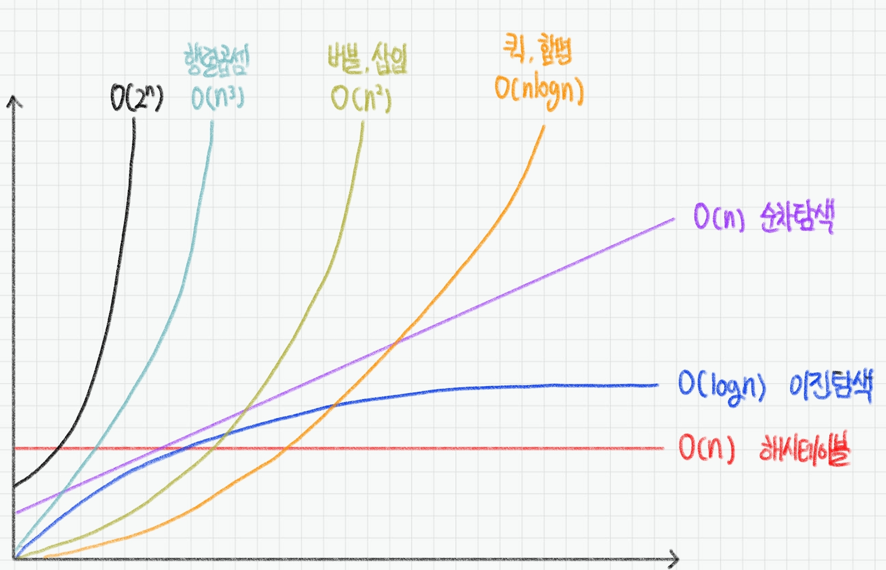

# ❓오늘 배운것 (22.07.26(화)) 


## ✍️시간 복잡도


### 1. 시간복잡도 (Time Complexity)

- 좋은 알고리즘이란? 
  - == Input을 넣은 후 Output이 나오는 시간이 짧은 알고리즘

- 알고리즘 소요 시간 측정하기
  - 기본연산의 총 횟수 == 알고리즘 소요시간
  - 최악의 입력 n개가 들어온다고 가정하고 시간 계산

- 알고리즘 성능 비교
  - `6n + 4` vs `3n + 2`  : 선형 증가, n이 무한대라면 차이 x
  - `3n + 2` vs `3n**2 + 6n + 1` : 제곱으로 증가, n이 무한대라면 엄청난 차이가 발생


### 2. 빅오 (Big - O) 표기법

- 입력 n이 무한대로 커진다고 가정하고 시간 복잡도를 간단하게 표시하는 것
- 최고차항만 남기고 계수와 상수는 배제

```bash
6n + 4 	       >> O(n)
3n + 2 	       >> O(n)
3n**2 + 6n + 1 >> O(n**2)
```

- 다양한 시간 복잡도 종류



```bash
O(1) : 단순 산술 계산 (+, -, *, /)
```

```bash
O(logN) : 리스트를 반절씩 순회 / 탐색 >> 이진탐색 (Binary Search), 분할정복 (Divide & Conquer)
```

```bash
O(N) : 리스트 순회 >> 1중 for문
```

```bash
O(NlogN) : 리스트를 반절씩 탐색 + 순회 >> 높은 성능의 정렬 (Merge, Quick, Heap)
```

```bash
O(N**2) : 2중 리스트 순회
```

```bash
O(2**n) : 집합의 부분 집합
```

```bash
O(N!) : 리스트의 순열
```

- 실제 문제에 어떻게 적용될까?
  - 보통 1초에 1억번 연산
  - 1초가 걸리는 입력의 크기
    - O(N) : 1억 
    - O(NlogN) : 500만 (x 20)
    - O(N**2) : 1만 (x 10,000)
    - O(N**3) : 500 (x 20만)


- 내장함수, 메서드의 시간복잡도도 확인할 필요가 있음
  - for문안에서 내장함수를 사용하면 사실상 2중 for문과 다름없음


