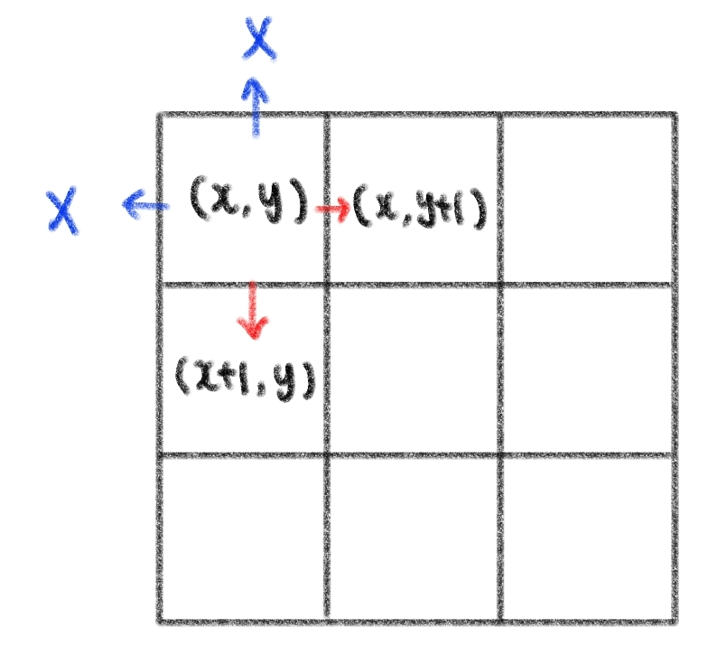

# ❓알고리즘 자료구조 (4)

​    

## ♾️ 완전탐색 (Exhaustive Search)

### 1. 브루트포스(Brute-force) 

- 모든 경우의 수를 탐색하여 문제를 해결하는 방식
- 무식하게 밀어 붙인다는 의미
- 가장 단순한 풀이기법, 단순 조건문과 반복문을 이용해서 해결 가능
- 복잡한 알고리즘보다는 아이디어를 어떻게 코드로 구현할 지가 핵심

```python
# m중 for문
for i in range(n-m-1):  	# 중복을 방지하기 위해 range 범위 잘 설정해야함
  for j in range(i+1, n-m):
    for k in range(j+1, n-m+1):
      ....
      
# 3중 for문
for i in range(n-2):
  for j in range(i+1, n-1):
    for k in range(j+1, n): 
```

​    

----

### 2. 델타 탐색 (Delta Search)

- 상하좌우 탐색
- (0, 0) 부터 이차원 리스트의 모든 원소를 순회하며 각 지점에서 상하좌우에 위차한 다른 지점을 조회하거나 이동하는 방식
- 행과 열의 변량인 -1, +1을 델타값

​    

>델타값을 이용해 상하좌우 이동하기

```python
dx = [-1, 1, 0, 0]  # 이 값들은 공식이 아니라 상황에 따라 다르게 변형하여 활용할 수 있음 ❗❗
dy = [0, 0, -1, 1]

# for문 활용
for i in range(4):
  nx = x + dx[i]
  ny = y + dy[i]
	
  # 범위를 벖어나지 않을때만 활용
  if 0 <= nx < 3 and 0 <= ny < 3:
    x = nx
    y = ny
```

.assets/델타탐색.jpg)



​    

---

## 😭 실습문제풀이 개념정리

```python
# (추가 공부) 순열과 조합

# 순열
from itertools import permutations

permutations(list, 뽑을 갯수)

# 조합
from itertools import combinations

combinations(list, 뽑을 갯수)
```

