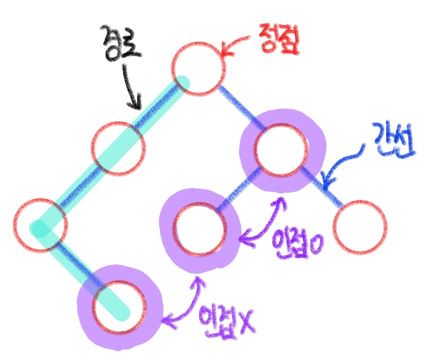
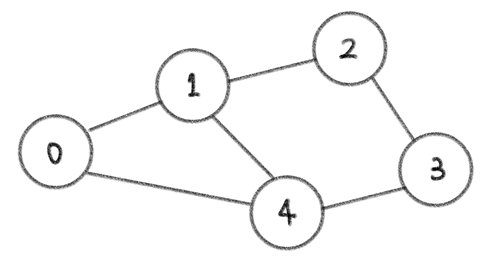
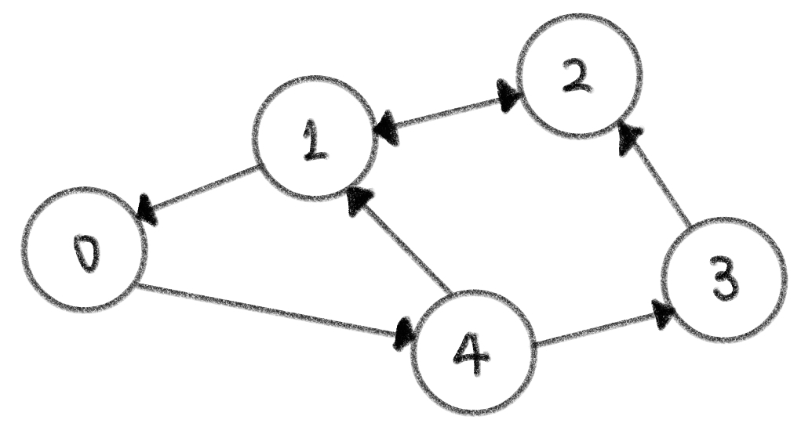

# ❓알고리즘 자료구조 (5)

​    

## ♾️ 그래프 (Graph)

- __정점(Vertex)__과 __간선(Edge)__들의 집합으로 이루어진 __비선형__ 자료구조 

- 현실에 있는 개체 간의 관계를 나타내는데 사용 (소셜 네트워크, 지하철 노선도)

​    

> ✍️ 용어 정리

1. 정점 (Vertex) : 간선으로 연결되는 객체, 노드 (Node)라고도 불림
2. 간선 (Edge) : 정점간의 관계, 즉 연결을 표시하는 선
3. 경로 (Path) : 시작 정점부터 도착 정점까지 거치는 정점을 나열한 것
4. 인접 (Adjacency) : 두 개의 정점이 하나의 간선으로 직접 연결된 상태




### 1. 그래프 종류

​    

> ✅ 차수 (Degree) : 하나의 정점에 연결된 간선의 개수

​    

#### 1. 무방향 그래프 (Undirected graph)

- 간선의 방향이 없음
- 간선을 통해 양방향 정점 이동가능
- 모든 정점의 차수 합 = 간선 수 x 2 



​    

#### 2. 유방향 그래프 (Directed graph)

- 간선의 방향이 있음
- 화살표가 가리키는 방향의 정점으로만 이동 가능
- 진입 차수와 진출 차수로 나뉨
  - 진입 차수 (In-degree) : 외부 정점에서 한 정점으로 들어오는 간선의 수
  - 진출 차수 (Out-degree) : 한 정점에서 외부 정점으로 나가는 간선의 수



​    

### 2. 그래프 표현

#### 1. 인접 행렬 (Adjacent matrix)

- 두 정점을 연결하는 간선이 없으면 0, 있으면 1을 가지는 행렬

.assets/인접행렬.jpg)

```python
# 입접 행렬 만들기
# 입력
0 1
0 2
1 3
1 4
2 4
2 5
4 6

n = 7 # 정점의 갯수
m = 7 # 간선의 갯수

graph = [[0] * n for _ in range(n)] # 0으로 초기화된 행렬 생성

for _ in range(m):
  v1, v2 = map(int, input().split())
  graph[v1][v2] = 1
  graph[v2][v1] = 1
  
  # 결과
graph = [
  [0, 1, 1, 0, 0, 0, 0],
  [1, 0, 0, 1, 1, 0, 0],
  [1, 0, 0, 0, 1, 1, 0],
  [0, 1, 0, 0, 0, 0, 0],
  [0, 1, 1, 0, 0, 0, 1],
  [0, 0, 1, 0, 0, 0, 0],
  [0, 0, 0, 0, 1, 0, 0]
]
```

​    

#### 2. 인접 리스트 (Adjacent list)

- 리스트를 통해 각 정점에 대한 인접 정점을 순차적으로 표현하는 방식

.assets/인접리스트.jpg)

```python
# 인접리스트 만들기
# 입력
0 1
0 2
1 3 
1 4
2 4
2 5 
4 6

n = 7 # 정점 개수
m = 7 # 간선 개수

graph = [[] for _ in range(n)] # 빈 이중리스트 만들기

for _ in range(m):
  v1, v2 = map(int, input().split())
  graph[v1].append(v2)
  graph[v2].append(v1)
  
# 인접 리스트 결과
graph = [     # 인덱스 번호가 정점의 번호 의미
  [1, 2],      # 0
  [0, 3, 4],   # 1 
  [0, 4, 5],   # 2
  [1],         # 3
  [1, 2, 6],   # 4
  [2],         # 5
  [4]          # 6
]
```

​    

> ❓인접 행렬과 인접 리스트 비교❓

- 인접 행렬 
  - 장점 : 직관적, 만들기 편함
  - 단점 : 불필요한 공간 사용
-  인접 리스트
  - 장점 : 연결된 정점만 저장해 효율적, 더 선호되는 방법

​    

> 무방향 vs 유방향 비교

```python
N, M = map(int,input().split())

matrix = [[0] * 7 for _ in range(7)]
lst = [[] for _ in range(7)] 

for i in range(M):
    u, v = map(int,input().split())
    # 유방향
    matrix[u][v] = 1 
    lst[u].append(v)
    
    # 무방향
    matrix[u][v] = 1
    matrix[v][u] = 1
    lst[u].append(v)
    lst[v].append(u)
```
