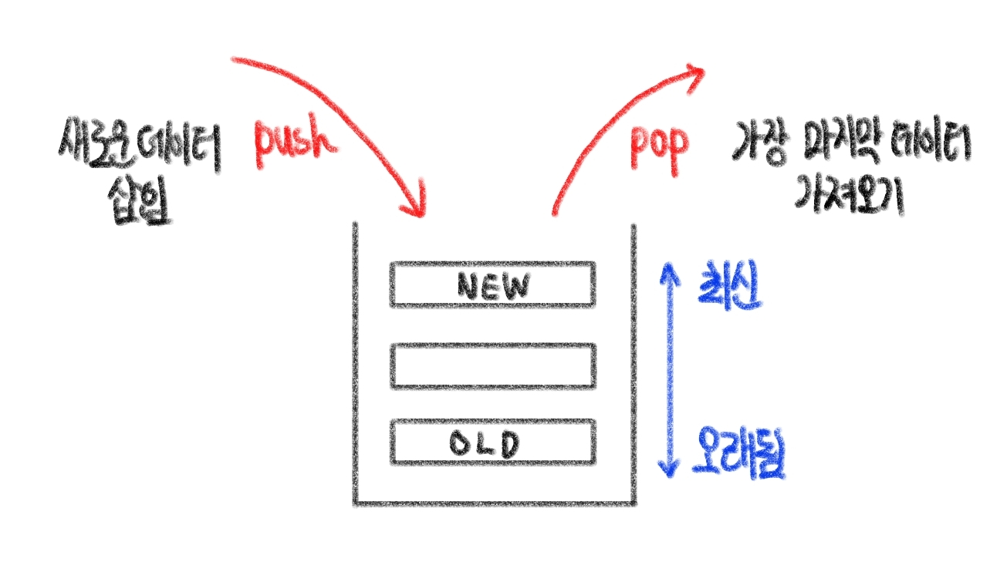
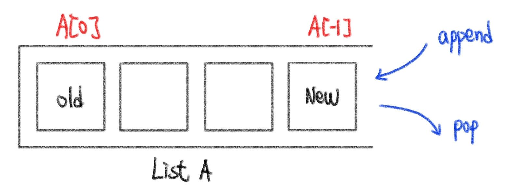
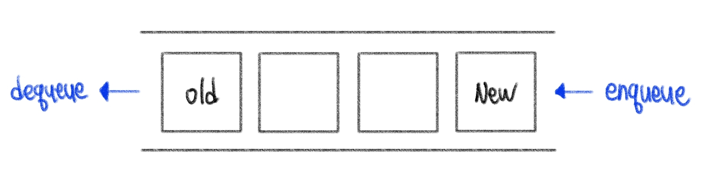
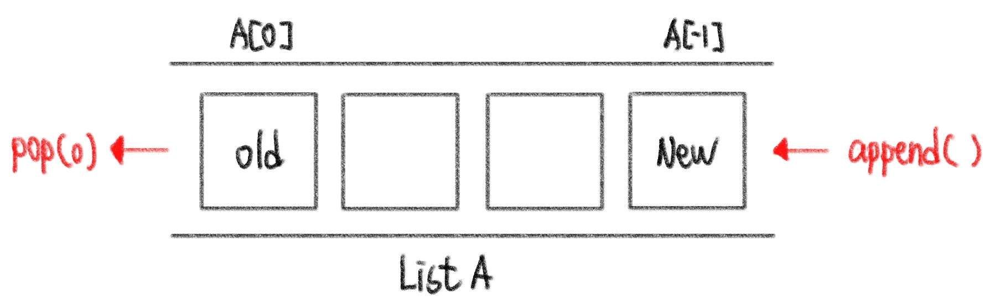

# ❓오늘 배운것 (22.08.01(월)) 


## ⛰️ 알고리즘 자료구조


### 1. 스택 (Stack)

- 데이터를 한쪽에서만 넣고 빼는 자료구조
- 가장 마지막에 들어온 데이터가 가장 먼저 나감 (후입선출) [LIFO : Last-in, First-out]



> 스택 사용이유

1. 뒤집기, __되돌리기__, 되돌아가기

​	ex) 브라우저 히스토리, ctrl + z, 단어 뒤집기

2. 마무리 되지 않은 일을 __임시저장__

​	ex) 괄호매칭, 함수호출, 백트래킹, DFS


> 스택 사용방법

- 리스트를 활용
  - 마지막 값 삽입 : `lst.append()`
  - 마지막 값 추출 : `lst.pop()`




---


### 2. 큐(Queue)

- 한쪽 끝에서 데이터를 넣고, 다른 한쪽에서만 데이터를 뺄 수 있는 자료구조

- 가장 먼저 들어온 데이터가 가장 먼저 나감 (선입선출) [FIFO : First-in First-out]




> 큐 사용방법

- 마지막 값 삽입 : `lst.append()`
- 첫번째 값 추출 : `lst.pop(0)`




> 리스트를 이용한 큐의 단점

- 데이터를 뺄 때 큐 안에 있는 데이터가 많은 경우 비효율적 [시간복잡도 : O(n)]


---


### 3. 덱 (Deque : Double-Ended Queue)

- 양 방향으로 삽입과 삭제가 자유로운 큐

- 양방향 삽입, 추출 모두 큐보다 훨씬 빠름 >> 삽입, 추출이 많은 경우 시간 크게 단축 가능


## 😭 실습문제풀이 개념정리

```python
# exit() 메소드 (프로그램 강제종료)
1. exit(0) : 오류 / 문제없이 깨끗한 하게 프로그램 종료
2. exit(1) : 문제 / 오류가 있음을 의미하며 오류반환

# 언패킹 (Unpacking) // 출력시 * (애스터리스크) 활용
lst = [1, 2, 3, 4]
print(*lst)
>> 1 2 3 4

# 변수명 줄이는 법
(1) for i in range(1, input()+1)
(2) queue = deque(range(1,n+1))
```

