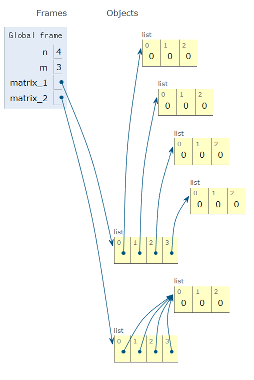
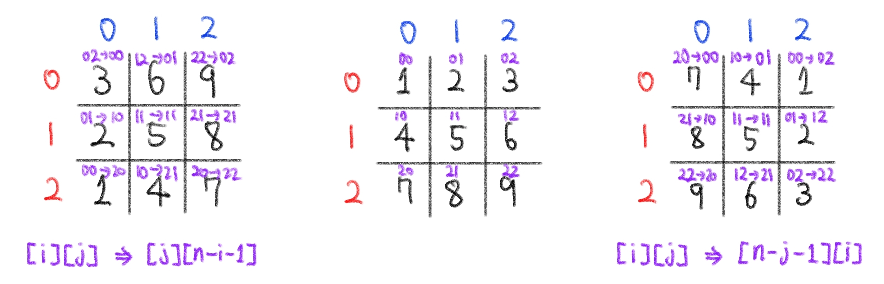

# ❓오늘 배운것 (22.08.03(수)) 


## ⛰️ 알고리즘 자료구조


### 이차원 리스트

- 리스트를 원소로 가지는 리스트

- 이차원 리스트는 `행렬 (matrix)`

```python
matrix = [
  [1, 2, 3],
  [4, 5, 6],
  [7, 8, 9]
]
```


#### 1. 특정 값으로 초기화된 이차원 리스트 만들기

1. 직접 작성

```python
matrix = [[0, 0, 0], [0, 0, 0], [0, 0, 0]]

matrix = [
  [0, 0, 0],
  [0, 0, 0],
  [0, 0, 0],
]
```

2.  반복문 활용

```python
# N X M 행렬
matrix = []

for _ in range(N):
	matrix.append([0] * M) 
```

3. 리스트 컴프리헨션 활용 ✔️✍️✅

```python
# N X M 행렬
matrix = [ [0] * m for _ in range(n)]
```

> ❗리스트 컴프리헨션과 리스트 곱셉 연산의 차이❗ 

```python
# N X M 행렬
matrix_1 = [[0] * m for _ in range(n)]  # 리스트 컴프리헨션 : 각각의 항목에 다른 리스트가 들어감
matrix_2 = [[0] * m] * n                # 리스트 곱셉 연산 : 같은 리스트를 가리킴
```




#### 2.입력 받기

1. 행렬의 크기가 미리 주어지는 경우


```python
'''
1 2 3
4 5 6
7 8 9
'''
# 1
matrix = []

for _ in range(3):
  line = list(map(int,input().split()))
  matrix.append(line)
  
# 2
matrix = [list(map(int,input().split())) for _ in range(4)]
```


1. 행렬의 크기가 입력으로 주어지는 경우

```python
'''
3 4
1 2 3 4
5 6 7 8
9 0 1 2
'''

n, m = map(int, input().split())
matrix = [list(map(int, input().split())) for _ in range(n)]
```


#### 3. 순회

1. 이중 for문을 이용한 __행 우선 순회__

```python
matrix = [
  [1, 2, 3, 4],
  [5, 6, 7, 8],
  [9, 0, 1, 2]
]

for i in range(3):    # 행
  for j in range(4):  # 열
    print(matrix[i][j], end=' ')
  print()
 
>> 1 2 3 4
>> 5 6 7 8
>> 9 0 1 2
```

2. 이중 for문을 이용한 __열 우선 순회__

```python
matrix = [
  [1, 2, 3, 4],
  [5, 6, 7, 8],
  [9, 0, 1, 2]
]
for i in range(4):    # 열
  for j in range(3):  # 행
    print(matrix[j][i], end=' ')
  print()
  
>> 1 5 9
>> 2 6 0
>> 3 7 1
>> 4 8 2
```


> 행 우선 순회를 이용해 이차원 리스트의 __총합__구하기

```python
# 방법1 (기본)
matrix = [
  [1, 1, 1, 1],
  [1, 1, 1, 1],
  [1, 1, 1, 1]
]

total = 0

for i in range(3):
  for j in range(4):
    total += matrix[i][j]
    
print(total)
```

```python
# 방법2 (파이써닉)
matrix = [
  [1, 1, 1, 1],
  [1, 1, 1, 1],
  [1, 1, 1, 1]
]

total = sum(map(sum, matrix))

print(total)
```


> 행 우선 순회를 이용한 이차원 리스트 __최대/최소값__ 구하기

```python
# 최대값
matrix = [
	[0, 5, 3, 1],
	[4, 6, 10, 8],
	[9, -1, 1, 5]
]

max_value = 0

for i in range(3):
  for j in range(4):
    if matrix[i][j] > max_value:
      max_value = matrix[i][j]
```

```python
# 최소값
matrix = [
	[0, 5, 3, 1],
	[4, 6, 10, 8],
	[9, -1, 1, 5]
]

min_value = -1e9

for i in range(3):
  for j in range(4):
    if matrix[i][j] < min_value:
      max_value = matrix[i][j]
```

```python
# 파이써닉한 방법 활용
matrix = [
	[0, 5, 3, 1],
	[4, 6, 10, 8],
	[9, -1, 1, 5]
]

max_value = max(map(max, matrix))
min_value = min(map(min, matrix))
```


#### 4. 전치

- 전치 (transpose) : 행렬의 행과 열을 서로 맞바꾸는 것을 의미

```python
matrix = [
  [1, 2, 3, 4],
  [5, 6, 7, 8],
  [9, 0, 1, 2]
]

transposed_matrix = [[0] * 3 for _ in range(4)] # 전치행렬을 담을 리스트 초기화

for i in range(4):
  for j in range(3):
    transposed_matrix[i][j] = matrix[j][i]  # 행, 열 맞바꾸기
```


#### 5. 회전

```python
matrix = [
  [1, 2, 3],
  [4, 5, 6],
  [7, 8, 9]
]

n = 3
rotated_matrix = [[0] * n for _ in range(n)] # 초기화

for i in range(n):
  for j in range(n):
    rotated_matrix[i][j] == matrix[j][n-i-1]  # 왼쪽으로 90도 회전
    rotated_matrix[i][j] == matrix[n-j-1][i]  # 오른쪽으로 90도 회전
```




---


## 😭 실습문제풀이 개념정리

```python
- 생각하지 못한 개념
# 이중리스트를 열 단위로 읽어내기 
matrix = [list(input()) for _ in range(n)]              # 행 읽기

for j in range('열'):
	[matrix[ _ ('행')][ j ('열')] for _ in range('행')]    # 열 읽기

# 1 x 1 직사각형의 크기와 좌표 매칭
# 문제에서 주어진 값을 활용한 범위 설정
```

