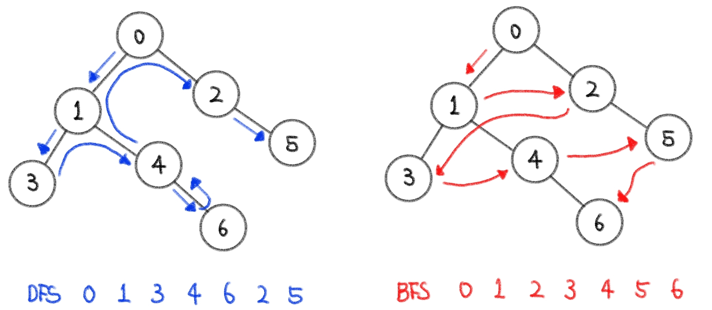

# ❓오늘 배운것 (22.08.10(수) )


## ⛰️ 알고리즘 자료구조

> 그래프 탐색 알고리즘

- 시작 정점에서 간선을 타고 이동할 수 있는 모든 정점을 찾는 알고리즘
- 깊이우선탐색 (DFS)과 너비우선탐색 (BFS)로 나뉨


---


### ✍️ 깊이우선탐색 (DFS : Depth First Search)

- 시작 정점부터 갈 수 있는 하위 정점까지 가장 깊게 탐색하고, 더 이상 갈 곳이 없다면 마지막 갈림길로 돌아와 다른 정점을 탐색하며, 모든 정점을 방문하는 순회 방법
- 모든 정점을 방문시 유리 (✔️미로탐색, 경우의 수, 순열과 조합✔️)
- BFS에 비해 코드 구현 간단
- 모든 정점을 방문할 필요가 없거나 최단 거리를 구하는 경우는 BFS가 유리




> DFS 구현방법

1. 각 정점을 방문했는지 여부를 판별할 방문 체크리스트 필요

```python
visited = [0] * n  # n은 정점의 개수
```

2. DFS 사이클
   1. 현재 정점 방문처리
   2. 인접한 모든 정점 확인
   3. 방문하지 않은 인접 정점 이동

- 예시

```python
graph = [
  [1, 2],
  [0, 3, 4],
  [0, 4, 5],
	[1],
  [1, 2, 6],
  [2],
  [4]
]

visited = [0] * n  # 방문 처리 리스트 만들기

def dfs(start):
  stack = [start] # 스택을 이용해 방문할 장소 기록
  visited[start] = 1 # 시작 정점 방문 처리
  
  while stack:  # 스택이 빌 때까지 반복 (방문할 장소가 없을때까지)
    cur = stack.pop()  # 현재 방문할 정점
    
    for adj in graph[cur]:   # 인접한 모든 정점에 대해
      if visited[adj] == 0:  # 아직 방문하지 않았다면
        visited[adj] = 1     # 1을 넣어줘 방문처리를 해줌
        stack.append(adj)    # 다음에 방문할 정점을 스택에 넣어줌
```


---


## 😭 실습문제풀이 개념정리

```python

```

