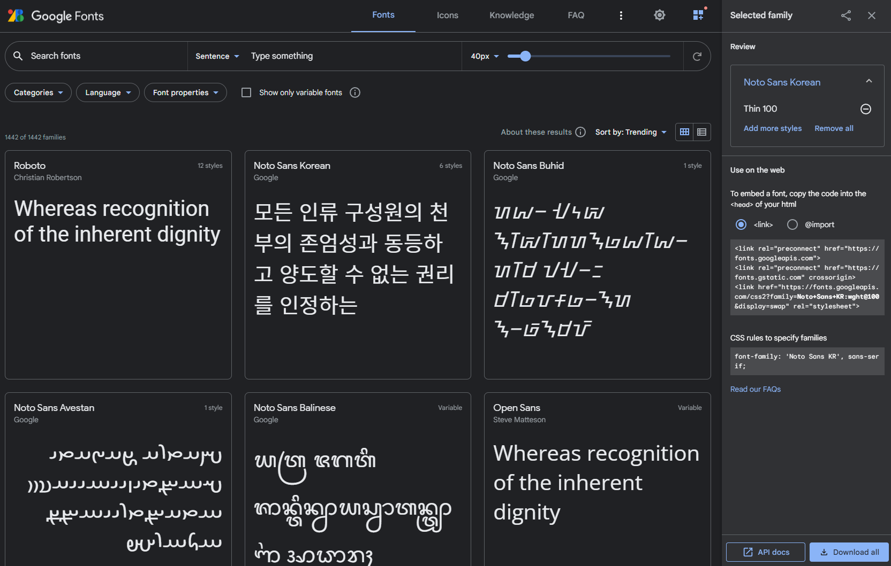

# CSS 작성 요령

## 1️⃣ emmet 활용법

자식 요소 : `>`

형제 요소 : `+`

상위 요소: `^`

그룹핑 : `( )`

개수지정 : `*`

클래스 지정 : `.class_name`

넘버링 : `$` 

> [cheatsheet_CSS.pdf](cheatsheet_CSS.pdf) 

​    

---

## 2️⃣ css 선언 순서

- 구글방식 : 알파벳 순서대로 배치
- nhn방식

| 순서 | 의미     | 속성                                                         |
| ---- | -------- | ------------------------------------------------------------ |
| 1    | 레이아웃 | display, float, position, top, right, bottom, left, z-index  |
| 2    | BOX      | width, height, margin, padding, border                       |
| 3    | 배경     | background                                                   |
| 4    | 폰트     | font, color, letter-spacing, text-align, text-decoration, text-indent, vertical-align, white-space |
| 5    | 기타     |                                                              |

​    

---

## 3️⃣ 구글 폰트

> [Google Font](https://fonts.google.com/)



```html
<!-- HTML -->
<link rel="preconnect" href="https://fonts.googleapis.com">
<link rel="preconnect" href="https://fonts.gstatic.com" crossorigin>
<link href="https://fonts.googleapis.com/css2?family=Noto+Sans+KR:wght@100&display=swap" rel="stylesheet">
```

```css
/* CSS */
font-family: 'Noto Sans KR', sans-serif;
```

​    

---

## 4️⃣ 부트스트랩 아이콘

> https://icons.getbootstrap.kr/
